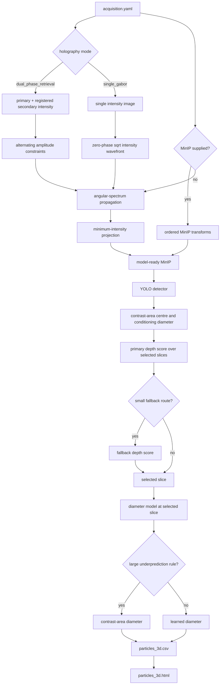

# Architecture

HoloD3 separates portable acquisition geometry from model/runtime policy and converges all interfaces on one executable pipeline.

## Public package

- `holod3/acquisition.py` validates acquisition schema, resolves relative paths, synchronizes image stems, and selects frames.
- `holod3/transforms.py` normalizes images and resolves built-in or user-provided transform functions.
- `holod3/reconstruction.py` implements shared dual-camera phase retrieval, single-Gabor initialization, propagation setup, distortion calibration, and MinIP generation.
- `holod3/config.py` validates inference model/runtime/fallback policy.
- `holod3/pipeline.py` exposes the Python facade and invokes the executable core.
- `holod3/detector.py` exposes detector-only inference.
- `holod3/visualization.py` builds self-contained Plotly animations.
- `holod3/datasets.py` installs private dataset bundles safely and atomically.
- `holod3/web.py` provides the trusted-local asynchronous Web workflow.

## Executable core

`src/pipeline/run_pipeline_fused.py` is the only complete pipeline entry point. It materializes exact MinIP inputs, runs detector and ROI measurement stages, and invokes the fused depth/diameter core.

`src/detection/depth_and_slice_fused.py` groups rows by frame, loads transformed raw holograms, creates a mode-specific wavefront, propagates through configured slices, crops particle regions, evaluates depth scores, selects a slice, and evaluates diameter without materializing a full 3D volume on disk.

The fused core receives all optical values from `AcquisitionConfig`; camera IDs, scene numbers, workspace names, fixed acquisition directories, and hard-coded physical scales are not part of its interface.

## Reconstruction conventions

Inputs represent intensity. Dual-camera mode uses square-root amplitude constraints at two planes for the configured iteration count. Single-Gabor mode uses square-root amplitude and zero phase at one plane.

Both paths use angular-spectrum transfer functions. The wavefront is mean-padded to `fft_padding_side`, propagated to `reconstruction_start_um`, and advanced by `slice_spacing_um`. Central `image_size_px × image_size_px` planes feed learned crop scoring.

The public coordinate convention is:

- `x_um = seg_xc × pixel_pitch_um`
- `y_um = seg_yc × pixel_pitch_um`
- `z_um = (slice - 1) × slice_spacing_um`
- `depth_um = reconstruction_start_um + z_um`

## Model roles

The four model roles have semantic aliases rather than training-run filenames:

- `detector.pt`
- `depth-primary.pt`
- `depth-fallback.pt`
- `diameter.pt`

The primary and fallback depth checkpoints share the FocusScoreNet family but differ in training data and routing role. The diameter checkpoint is a combined focused/dense SliceDiamModel.

## Fallback boundaries

Fallbacks operate on row-level measurement metadata and remain optional. They never silently replace a missing checkpoint or failed backend. Backend requirements and model-file integrity are validated separately.

Every final row records the selected depth checkpoint, depth route, conditioning-diameter method, learned diameter, fallback decision, final diameter source, and the exact checkpoint SHA-256/byte size. Run JSON uses portable path identifiers so sharing a result does not expose the workstation root.

## Extension points

- Add instrument preprocessing through transform plugins, not core forks.
- Add acquisition modes in `holod3/reconstruction.py` while preserving the normalized wavefront contract.
- Add model variants through inference YAML or API model overrides.
- Add downstream analysis from `particles_3d.csv`; temporal tracking is intentionally outside this repository.

Unit tests exercise each boundary independently. Full GPU smoke tests verify that the public facade and executable core use the same acquisition and model policy.
